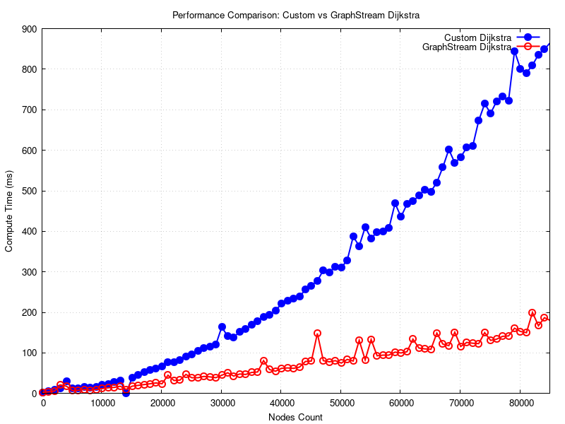

# Rapport d'Évaluation des Performances de l'Algorithme de Dijkstra

## Introduction

L'algorithme de Dijkstra est l'un des algorithmes les plus utilisés pour résoudre le problème du plus court chemin dans un graphe pondéré. Ce rapport décrit l'implémentation et l'évaluation de cet algorithme en le comparant à une version existante fournie par la bibliothèque GraphStream. Nous avons réalisé des tests de performance pour analyser la différence entre ces deux implémentations, en mesurant le temps d'exécution en fonction de la taille du graphe.

Ce rapport est structuré comme suit :

*    Une description du générateur de graphes utilisé.
*    Une présentation de l'algorithme de Dijkstra que nous avons implémenté.
*    Une comparaison avec l'implémentation fournie par GraphStream.
*    Une présentation des tests effectués et des résultats obtenus.
*    Une analyse des résultats et une conclusion.

---

## Description du générateur utilisé et ses paramètres

Le générateur de graphes utilisé dans cette étude est un générateur aléatoire de graphes, disponible dans la bibliothèque GraphStream. Ce générateur permet de créer des graphes avec un nombre variable de sommets et une connectivité aléatoire déterminée par un degré moyen des nœuds. Le but est de simuler des graphes de taille et de structure variées afin d'évaluer la performance des deux algorithmes de Dijkstra dans des scénarios réalistes.

Paramètres du générateur :

* Nombre de nœuds: Ce paramètre définit le nombre total de sommets dans le graphe. Les tests sont effectués avec des graphes de taille croissante.

* Degré moyen: Ce paramètre détermine le nombre moyen de voisins par nœud, influençant ainsi la densité du graphe. 

Le générateur crée des arêtes aléatoires entre les nœuds et attribue des poids aléatoires à ces arêtes dans un intervalle donné (ici de 0 à 100). Chaque arête a donc un poids aléatoire représentant une distance ou un coût entre deux nœuds du graphe.

---

## Description de l'algorithme de Dijkstra implémenté

L'algorithme de Dijkstra que nous avons implémenté est une version naïve qui fonctionne de la manière suivante :

**Initialisation** :

* Chaque nœud du graphe est initialisé avec une distance infinie, sauf pour le nœud source qui est initialisé avec une distance de 0.

* Un tableau de prédecesseurs (prevs) est également initialisé pour reconstruire les chemins une fois l'algorithme terminé.

* Une priority queue (file de priorité) est utilisée pour explorer les nœuds en fonction de leur distance la plus courte connue.

**Boucle principale** :

* Le nœud avec la distance la plus courte est retiré de la file de priorité.

* Tous ses voisins sont ensuite explorés. Si un voisin peut être atteint par un chemin plus court via le nœud actuel, sa distance et son prédécesseur sont mis à jour.

* La priorité du nœud voisin est ensuite mise à jour dans la file de priorité.

**Finalisation** :

* Une fois que tous les nœuds ont été explorés, l'algorithme retourne la table des distances et des prédécesseurs.

L'algorithme est conçu pour être simple et direct, sans optimisations supplémentaires qui pourraient améliorer l'efficacité pour de grands graphes.

---

## Description de l'algorithme de Dijkstra de GraphStream

Cet algorithme correspond à une **implémentation de Dijkstra** utilisant un **tas de Fibonacci** pour la gestion des nœuds et de leurs distances minimales. Cette version de Dijkstra permet une gestion plus performante des **opérations de mise à jour des priorités**, en particulier la **diminution de clé**. Voici une explication détaillée de l'algorithme :

#### Description de l'algorithme

##### Initialisation avec un tas de Fibonacci

1. **Création du tas de Fibonacci** :

* L'algorithme commence par initialiser un tas de Fibonacci (`FibonacciHeap<Double, Node> heap`) qui servira à stocker les nœuds du graphe et leurs distances respectives. Le tas de Fibonacci est utilisé pour garantir une gestion efficace des opérations d'extraction du minimum et de diminution de clé.

2. **Initialisation des nœuds** :

Chaque nœud du graphe est associé à une structure de données `Data`, qui contient :

- La distance minimale du nœud à la source (`v`). Si le nœud est la source, sa distance est égale à 0, sinon, elle est définie sur **`Double.POSITIVE_INFINITY`** (distance infinie).
- Une référence à l'élément du tas de Fibonacci (`fn`), qui contient la distance du nœud.
- Une référence à l'arête qui mène au parent de ce nœud dans l'arbre des plus courts chemins (`edgeFromParent`), initialisée à `null`.

Cette structure de données est associée à chaque nœud dans l'attribut `resultAttribute` du nœud (une sorte de stockage des résultats pour chaque nœud).

##### Boucle principale de l'algorithme

3. **Boucle principale** :

L'algorithme itère tant que le tas de Fibonacci n'est pas vide (`!heap.isEmpty()`). À chaque itération :

- **Extraction du nœud avec la plus petite distance** :
Le nœud `u` avec la plus petite distance estimée (c'est-à-dire celui dont la clé du tas est la plus petite) est extrait du tas de Fibonacci avec `heap.extractMin()`. Ce nœud `u` est ensuite traité.

- **Mise à jour des voisins de `u`** :
Pour chaque arête sortante de `u`, l'algorithme examine le nœud adjacent `v` (le nœud auquel l'arête mène). Si l'arête est valide (c'est-à-dire que l'attribut `fn` du nœud opposé n'est pas `null`), l'algorithme tente de **relaxer** la distance de `v` :

- Il calcule la distance potentielle en passant par `u` via l'arête `e` : `tryDist = dataU.distance + this.getLength(e, v)`, où `dataU.distance` est la distance actuelle de `u`, et `this.getLength(e, v)` est la longueur (ou poids) de l'arête.

- Si cette nouvelle distance est plus petite que la distance actuelle de `v`, l'algorithme met à jour la distance de `v`, et modifie l'arbre de parcours en attribuant à `v` l'arête `e` comme l'arête menant à son parent dans l'arbre des plus courts chemins.

- Ensuite, l'algorithme utilise la méthode `heap.decreaseKey()` pour diminuer la priorité de `v` dans le tas de Fibonacci, en mettant à jour la distance de `v`.

4. **Finalisation pour `u`** :

Après avoir mis à jour les voisins de `u`, l'algorithme marque `u` comme traité :

- La distance finale de `u` est extraite du tas de Fibonacci, et elle est enregistrée dans `dataU.distance`.

- Le `fn` de `u` est annulé (`dataU.fn = null`) puisque `u` a été complètement traité.

- Si `u` a un parent (si `dataU.edgeFromParent != null`), l'algorithme marque cette arête comme faisant partie du chemin optimal en appelant la méthode `this.edgeOn(dataU.edgeFromParent)`.

##### Résumé des opérations de l'algorithme :

- **Initialisation** : Chaque nœud reçoit une distance infinie, sauf le nœud source qui reçoit une distance de 0. Les nœuds sont insérés dans un tas de Fibonacci.

- **Exploration** : Le nœud avec la plus petite distance est extrait du tas, et ses voisins sont explorés et mis à jour si un chemin plus court est trouvé.

- **Relaxation** : Si la distance à un voisin est améliorée, la clé de ce voisin dans le tas est mise à jour avec la nouvelle distance.

- **Finalisation** : Une fois le nœud traité, son résultat est finalisé et il est marqué comme complètement exploré.

#### Explication des composantes clés :

- **Fibonacci Heap** : Le tas de Fibonacci est utilisé pour optimiser les performances de l'algorithme de Dijkstra. Contrairement à un tas binaire, un tas de Fibonacci permet de diminuer la clé d'un nœud en temps constant **O(1)** et d'extraire le minimum en **O(log n)**.
- **Relaxation** : La relaxation consiste à mettre à jour les distances des voisins d'un nœud si un chemin plus court est trouvé. Cette opération est au cœur de l'algorithme de Dijkstra.
- **EdgeFromParent** : Cette référence garde trace de l'arête qui mène au parent d'un nœud dans le chemin optimal. Elle est utilisée pour reconstruire le chemin une fois l'algorithme terminé.

Cette version de l'algorithme de Dijkstra utilisant un tas de Fibonacci est particulièrement efficace pour les grands graphes. L'optimisation de la mise à jour des priorités (diminution de clé) permet de traiter de manière plus rapide et plus efficace les graphes avec un grand nombre de nœuds et d'arêtes.

---

## Description des tests effectués et justification des choix

Objectifs des tests : Nous avons cherché à évaluer et comparer les performances des deux versions de Dijkstra sur des graphes de tailles croissantes. Les tests visent à mesurer le temps d'exécution en fonction du nombre de nœuds dans le graphe. Pour ce faire, nous avons utilisé un générateur de graphes aléatoires pour créer des graphes avec des tailles croissantes et avons mesuré le temps nécessaire pour exécuter l'algorithme de Dijkstra pour chaque graphe.

Critères de comparaison :

* Temps d'exécution : Temps total nécessaire pour calculer les plus courts chemins depuis un nœud source vers tous les autres nœuds du graphe.

* Scalabilité : La manière dont chaque algorithme gère l'augmentation de la taille du graphe.

Choix des graphes :

* Nous avons utilisé des graphes avec des nœuds allant de 100 à +100 000 afin de tester l’algorithme sur des graphes de tailles petites à grandes.

* Un degré moyen de 5 a été choisi pour générer des graphes modérément connectés, ce qui simule des graphes réalistes.

---

## Résultats obtenus

Les résultats des tests sont présentés sous forme de courbes illustrant le temps d'exécution des deux algorithmes en fonction du nombre de nœuds dans le graphe. Les données brutes ont été enregistrées et traitées dans un format tabulaire, puis utilisées pour générer des courbes avec Gnuplot.
Courbes des temps d'exécution :

    Axe des x : Nombre de nœuds dans le graphe (de 100 à 100 000).
    Axe des y : Temps d'exécution en millisecondes.

Les résultats montrent que l'algorithme GraphStream a des temps d'exécution plus courts, surtout pour les graphes plus grands. La version naïve de Dijkstra montre une augmentation plus marquée du temps d'exécution avec la taille du graphe, en raison de son utilisation moins optimale des structures de données.
Observations :

Pour les graphes petits (jusqu'à environ 1 000 nœuds), les différences de performance sont faibles.

À partir de 2 000 nœuds, la version GraphStream commence à montrer un avantage significatif.

À partir de 5 000 nœuds, l'algorithme GraphStream reste largement plus rapide et montre une croissance moins rapide du temps d'exécution.
    
 
---

## Explication des résultats

Les résultats montrent une différence de performance entre les deux implémentations, principalement due aux optimisations dans l'implémentation de GraphStream. L'implémentation naïve de Dijkstra, utilisant une simple priority queue, souffre de l'inefficacité de la mise à jour des priorités des nœuds voisins, ce qui augmente le temps d'exécution avec la taille du graphe.

L'algorithme de GraphStream, en revanche, utilise des structures de données plus optimisées, notamment un tas de Fibonacci, ce qui permet des opérations plus rapides lors de la mise à jour des distances et des priorités. Cette différence devient particulièrement visible pour les grands graphes, où l'optimisation de GraphStream est un facteur clé pour maintenir des temps d'exécution raisonnables.

--- 

## Conclusion

Ce rapport a permis de comparer deux versions de l'algorithme de Dijkstra : une implémentation naïve et une implémentation optimisée par GraphStream. Les résultats montrent que l'algorithme de GraphStream est nettement plus efficace pour les grands graphes en raison de l'utilisation d'une structure de données plus appropriée, comme le tas binaire.

Les tests ont montré que pour des graphes de petite taille, la différence de performance n'est pas significative, mais à mesure que la taille du graphe augmente, l'algorithme optimisé prend un avantage considérable.

Dans le cadre de projets nécessitant des graphes de grande taille, l'utilisation de GraphStream ou d'autres versions optimisées de Dijkstra est fortement recommandée pour obtenir des résultats dans un délai raisonnable.

---

